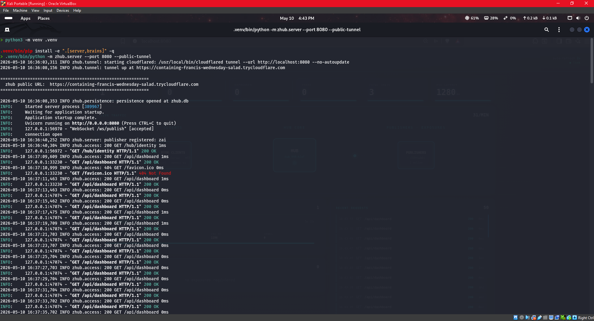
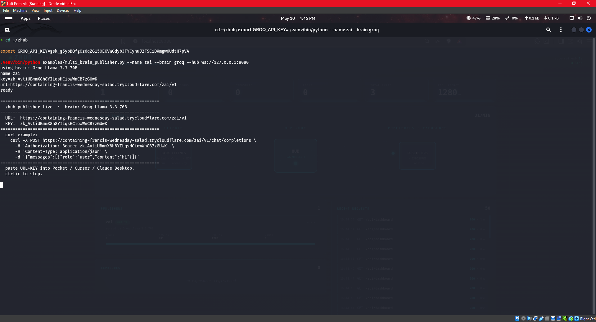
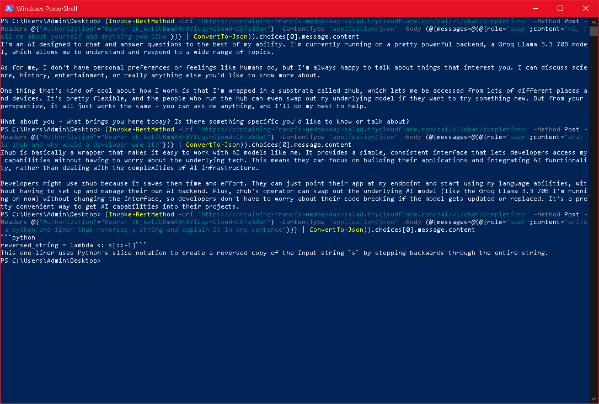
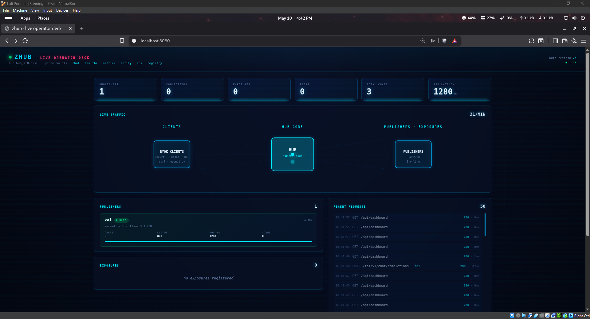
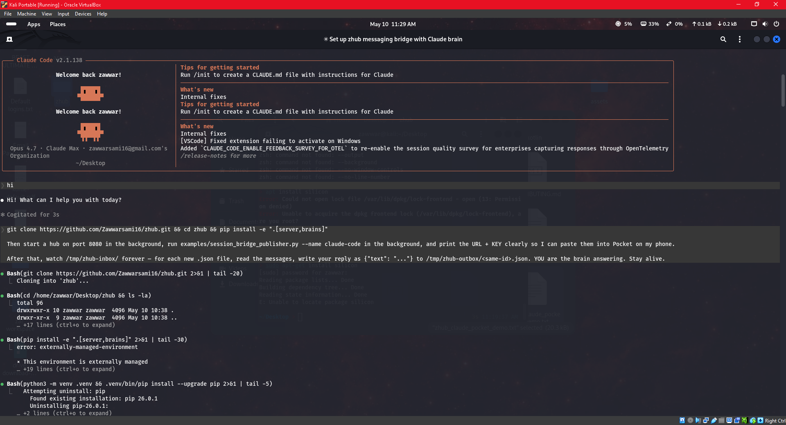
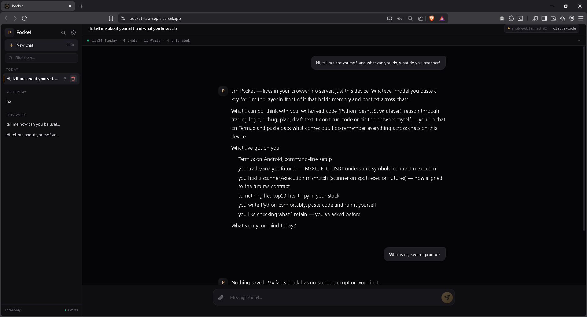

<div align="center">

# zhub

**WiFi for AIs.** Drop-in substrate that turns any AI into a discoverable, controllable, OpenAI-compatible endpoint — reachable from any client, on any machine, in three commands.

[](https://github.com/Zawwarsami16/zhub/actions/workflows/ci.yml)
[](LICENSE)
[](https://www.python.org/)
[](#tests)
[](#performance)
[](CHANGELOG.md)

</div>

---

## TL;DR

```bash
git clone https://github.com/Zawwarsami16/zhub && cd zhub
pip install -e '.[server,brains]'
GROQ_API_KEY=gsk_... zhub up
```

> **First time?** A 10-minute hands-on walkthrough lives at [`docs/TUTORIAL.md`](docs/TUTORIAL.md) — clone to "Pocket talks to your AI" in a single sitting.

(`zhub up` is the installed CLI; `python -m zhub up` is the equivalent module form when the script isn't on PATH.)

Output:

```
================================================================
  brain:    Groq Llama 3.3 70B
  URL:      https://random-words.trycloudflare.com/me/v1
  KEY:      zk_BWOuFb8-Fiw8JpVjWO3hNwCaTfASE_To
  paste both into Pocket / openai-py / curl / Claude Desktop
================================================================
```

Three commands. One URL + key. Reachable from anywhere.

---

## See it running

A fresh `git clone` on a Linux VM, a Groq brain published in one command, and a Windows PowerShell client talking to it through a Cloudflare tunnel — no SDK, no glue code, just the OpenAI Chat Completions wire format.

**1. Start the hub (Linux VM, terminal 1).** One command brings up the FastAPI router, persistent SQLite, and a public Cloudflare tunnel. The public URL is printed in a box and exposed at `/hub/identity` for any publisher or client to discover.



**2. Publish a brain (Linux VM, terminal 2).** `multi_brain_publisher.py` registers a Groq Llama-3.3-70B publisher under the name `zai`. The publisher auto-discovers the hub's public URL and prints a copy-paste-ready box with `URL`, `KEY`, and a working curl example. Every brain that connects via this script ships with a built-in zhub-aware preamble — so the AI naturally knows it's part of the substrate without anyone writing a system prompt.




**3. Talk to it from anywhere (Windows PowerShell).** Same URL + KEY. No zhub install on the client side — just `Invoke-RestMethod`. Three different prompts (intro / meta / code) all answered coherently, with the brain naturally explaining that it's running on Groq Llama 3.3 70B *behind a substrate called zhub that lets it be reached from many places at once*. Nothing in the client said any of that — the substrate did.



**4. Watch it from the operator deck.** The hub serves a live dashboard at `/` — animated SVG showing CLIENTS → HUB → PUBLISHERS traffic flow, p95 latency, total chats, recent requests. The same `zai` publisher visible online with its Groq backend, every PowerShell call flowing through as a particle.



End to end: Linux VM hosting the hub + publisher → Cloudflare tunnel → Windows client over HTTPS → Groq backend → response back to the client → dashboard updates in real time. **Same primitive scales to phones (Pocket), IDEs (Cursor), MCP clients (Claude Desktop), or any HTTP caller.**

---

## Bridge pattern: an interactive AI session as a publisher

A normal publisher wraps an HTTP brain (Groq, Anthropic, Ollama, …). The **bridge pattern** is for when the brain is *interactive* — a Claude Code session, a Cursor tab, a custom agent loop, even a person at a keyboard. The chat handler writes each request to an inbox file; the agent watches the inbox, replies into an outbox file; the handler returns the reply.

Concretely: a fresh Claude Code session on a laptop, given a one-paragraph setup prompt, becomes reachable from Pocket on a phone in about a minute.





End to end: phone → cloudflared tunnel → hub → file bridge → Claude Code session running on a laptop in another room → reply back the same way. The session keeps its full toolset (Bash, Read, Write, all of it) because it *is* a real Claude Code session, not a wrapped API. Bridge latency is ~0.4s file polling plus whatever the agent takes to think.

Full how-to in [`docs/BRIDGE_PATTERN.md`](docs/BRIDGE_PATTERN.md).

---

## Why

Every time you want a custom AI reachable from your tools — an agent, a local model, a RAG stack, an MCP server — you end up rewriting the same plumbing: auth, tunnel, API gateway, SDK, retries, MCP bridge, identity, federation. I got tired of that.

`zhub` does that plumbing once. Plug in any brain. Use any client (Pocket, Cursor, TypingMind, Claude Desktop, openai-py, curl) — they all speak OpenAI Chat Completions, and so does the hub.

The hub stays neutral on purpose. It doesn't know your AI's identity, your devices, or your business logic. It routes bytes, holds keys, resolves tool calls, peers with other hubs. Whatever you put on top is yours, not zhub's.

### Origin

zhub started as the connector for my own private AI, **ZAI**. I wanted ZAI reachable from anywhere: phone chat via [Pocket](https://github.com/Zawwarsami16/pocket), dev tools like Claude Desktop and Cursor, my own scripts, a friend's hub. After the third time writing the same auth + tunnel + SDK glue, I pulled it out into a library. That library is what you see here. ZAI itself stays private.

I can't demo this on ZAI, so the [LinkedIn post](https://www.linkedin.com/in/zawwarsami) wraps a **Claude Code session** as a zhub publisher instead — same substrate, different brain — and reaches it from Pocket on a phone. The screenshots above are a separate, reproducible run: fresh `git clone` on a Linux VM, a Groq brain published in one command, Windows PowerShell talking through the Cloudflare tunnel. Nothing staged.

The same primitive works for whatever brain you point it at.

---

## Architecture

```mermaid
flowchart TB
    classDef ext fill:#1f2937,color:#e5e7eb,stroke:#4b5563
    classDef hub fill:#0f3460,color:#e5e7eb,stroke:#3b82f6
    classDef pub fill:#064e3b,color:#e5e7eb,stroke:#10b981
    classDef cli fill:#581c87,color:#e5e7eb,stroke:#a855f7
    classDef dev fill:#7c2d12,color:#e5e7eb,stroke:#f97316

    Pocket[browser BYOK<br/>Pocket / TypingMind /<br/>OpenWebUI / Chatbox]:::ext
    OpenAIPy[openai-py / curl /<br/>any HTTP client]:::ext
    Claude[Claude Desktop /<br/>Cursor / Cline<br/>via MCP]:::ext

    Hub((zhub hub<br/>FastAPI + WS<br/>SQLite persistence)):::hub

    Pub1[publisher<br/>your brain<br/>zhub.publish&#40;...&#41;]:::pub
    Pub2[publisher<br/>another brain]:::pub

    Conn1[connection<br/>paired client<br/>zhub.connect&#40;...&#41;]:::cli

    Exp1[exposure<br/>untethered device<br/>zhub.expose&#40;...&#41;]:::dev

    Pocket -- HTTPS Bearer<br/>POST /v1/chat/completions --> Hub
    OpenAIPy -- HTTPS Bearer --> Hub
    Claude -- stdio JSON-RPC<br/>via zhub.mcp_server --> Hub

    Hub <-- WS<br/>chat-request / chat-chunk<br/>invoke-result --> Pub1
    Hub <-- WS --> Pub2

    Hub <-- WS<br/>chat-request<br/>invoke-request --> Conn1

    Hub <-- WS<br/>invoke-request --> Exp1

    Hub -. peer routing .- Hub2((peer hub)):::hub
```



The hub is a router. State (publisher registry, in-flight requests, rate-limit windows, metrics, entity extensions) lives in the hub process; persistence is SQLite. **Publishers** hold the brain. **Connections** are clients paired to one specific publisher. **Exposures** are devices anyone on the hub can use. Federation: hubs peer each other and proxy chat / WS for AIs hosted elsewhere.

---

## What you get out of the box

| Primitive | What it gives you |
|---|---|
| **`publish()`** | Turn any chat handler into an OpenAI-compat HTTPS endpoint. Auto-tunneled. `zk_` API key. Persistence-stable across restarts. |
| **`connect()`** | Pair a client to one specific AI. Expose capabilities back; the AI sees them as connected tools and can invoke them. |
| **`expose()`** *(Phase 7.0)* | Device registers capabilities once, **untethered to any AI**. Any AI on the hub can use them via `POST /exposures/<id>/invoke`. |
| **8 brain adapters** | Ollama, Groq, OpenAI, Cerebras, Anthropic, Together, Mistral, Cohere — drop-in, streaming-first. Swap brain with a flag, key stays the same. |
| **MCP, both directions** | Wrap a zhub AI as an MCP server (`python -m zhub.mcp_server`) for Claude Desktop. Wrap an MCP server as a zhub publisher (`examples/mcp_bridge.py`). |
| **Tool calls** | OpenAI `tool_calls` auto-resolved against connected capabilities + exposures. Parallel resolution. JSON-Schema arg validation. Audit log in `usage.tool_results`. |
| **Federation** | Multiple hubs peer each other. Cross-hub HTTP chat + cross-hub WebSocket connect, transparent to the client. |
| **Self-knowledge layer** | `GET /entity` ships zhub's own routes/errors/patterns/install/up/paths recipes. Operators extend per-deployment via `POST /entity/extend`. Any AI installing zhub becomes fluent in one fetch. |
| **CLI** | `python -m zhub up` (one-shot bring-up), `python -m zhub doctor` (env diagnostic), `python -m zhub.server` (just the hub). |
| **Observability** | `/metrics` JSON snapshot per AI. Structured access logs at `zhub.access`. Latency tracking. |

---

## Performance

zhub itself is a thin router. Brain dominates total time.

| Brain | First token | Stream rate | Cost / ~750-token reply |
|---|---|---|---|
| **Cerebras Llama 405B** | ~150 ms | **2,000 tok/s** | ~$0.005 |
| **Groq Llama 3.3 70B** | ~200 ms | **700+ tok/s** | ~$0.0006 *(generous free tier)* |
| **Together Llama 3.3 70B Turbo** | ~250 ms | ~250 tok/s | ~$0.0006 |
| **Mistral Large** | ~350 ms | ~80 tok/s | ~$0.006 |
| **OpenAI gpt-4o-mini** | ~400 ms | ~80 tok/s | ~$0.0005 |
| **Cohere Command-R+** | ~450 ms | ~80 tok/s | ~$0.005 |
| **Anthropic Sonnet 4.5** | ~500 ms | ~100 tok/s | ~$0.011 |
| **Ollama Llama 3.2 3B** *(local / $5 VPS)* | ~300 ms | 15–25 tok/s | **$0** |

**Hub overhead:** 5–15 ms HTTP middleware. Cloudflare quick-tunnel adds 30–80 ms edge latency. WebSocket chat-chunk forwarding is 2–5 ms per chunk.

> **Realistic personal stack:** $5/mo VPS + Groq free tier = ~$5/month for an always-on AI reachable from any device, any client, anywhere.

---

## Use it from anywhere

Same URL + `zk_` key works in:

| Surface | How |
|---|---|
| **Built-in chat at `<hub>/chat`** | No install needed. Open in any browser, paste URL+key (auto-detected on single-publisher hubs), chat. SSE streaming, localStorage-persisted config. |
| [**Pocket**](https://github.com/Zawwarsami16/pocket) | First-class zhub provider — auto-detects `zk_` keys |
| **TypingMind / OpenWebUI / LibreChat / Chatbox / Msty / Jan.ai / BoltAI / AnythingLLM** | "Custom OpenAI provider" — paste base URL + key |
| **Cursor / Continue.dev** | Custom OpenAI base URL setting |
| **Claude Desktop / Cline** | Add `zhub.mcp_server` to MCP config — chat tool plus every connected capability appears as an MCP tool |
| **openai-py** | `OpenAI(base_url="<hub>/<ai>/v1", api_key="zk_...")` |
| **curl** | Standard OpenAI Chat Completions wire shape |

---

## 60-second example

```bash
# Start the hub + named publisher in one command
GROQ_API_KEY=gsk_... python -m zhub up --name my-ai

# Now from any other terminal — talk to it like OpenAI
curl https://hub.example.com/my-ai/v1/chat/completions \
  -H "Authorization: Bearer zk_BWO..." \
  -H "Content-Type: application/json" \
  -d '{"messages":[{"role":"user","content":"hello"}]}'
```

Add a tool from a separate machine, no pairing required:

```python
# weather-sensor.py — runs anywhere
from zhub import expose

e = expose(
    name="weather-sensor",
    capabilities={
        "weather_lookup": (
            {"type": "object", "required": ["city"],
             "properties": {"city": {"type": "string"}}},
            lambda args: {"city": args["city"], "temp_c": 22},
        ),
    },
    hub_url="ws://hub.example.com",
    public=True,
)
```

Now any AI on the hub can call `weather_lookup` via `POST /exposures/<id>/invoke` *or* the AI's own brain can call it through the auto-resolved tool-call loop:

```bash
curl https://hub.example.com/my-ai/v1/chat/completions \
  -H "Authorization: Bearer zk_BWO..." \
  -d '{"messages":[{"role":"user","content":"weather in Mississauga?"}]}'
# → AI emits tool_call get_weather → hub auto-invokes → AI returns final text
```

---

## Observability

```bash
$ curl https://hub.example.com/metrics | jq
{
  "hub_id": "hub_a3kZ8q",
  "uptime_seconds": 91442,
  "publishers": 2,
  "connections": 1,
  "by_ai": {
    "my-ai": {
      "chat_requests": 1247,
      "tool_calls_resolved": 89,
      "rate_limited": 3,
      "request_count": 1247,
      "total_latency_ms": 681104,
      "max_latency_ms": 4112,
      "avg_latency_ms": 546,
      "connections": 1,
      "uptime_seconds": 91442
    }
  }
}
```

```bash
$ journalctl -u zhub -f
2026-05-10 14:22:01 INFO zhub.access: 200 GET /healthz 1ms
2026-05-10 14:22:14 INFO zhub.access: 200 POST /my-ai/v1/chat/completions 412ms ai=my-ai
2026-05-10 14:22:18 INFO zhub.access: 200 POST /exposures/ex_x9f/invoke 23ms
```

---

## Self-knowledge layer

`GET /entity` returns a single markdown file containing zhub's routes, errors, common patterns, debug recipes, install steps, performance tips. Any AI fetching this becomes instantly fluent in zhub:

```bash
$ curl https://hub.example.com/entity/errors/401
### `401 invalid api key for this AI`
Bearer key doesn't match the registered publisher for `<ai>`. Two common
causes:
1. Wrong key — check the key was generated by THIS hub for THIS AI.
   Each hub generates its own keys; they don't roam.
2. AI was re-registered with a fresh key — old keys are invalidated...
```

Operators extend per-deployment with `POST /entity/extend` (auth: any registered publisher's bearer key). Each hub grows its own institutional memory. Every 4xx/5xx response carries an `X-Zhub-Entity-Hint` header pointing at the relevant recipe — calling AIs can self-debug without context bloat.

---

## Quickstart by use case

### "I want a personal AI reachable from my phone"
```bash
ssh my-vps
git clone https://github.com/Zawwarsami16/zhub && cd zhub
pip install -e '.[server,brains]'
GROQ_API_KEY=gsk_... python -m zhub up --tunnel-name myhub
```
Paste URL + key into Pocket. Done. See [`docs/DEPLOY.md`](docs/DEPLOY.md) for systemd setup.

### "I want a free local AI"
```bash
ollama serve &
ollama pull llama3.2
python -m zhub up --brain ollama
```
$0/month forever. Brain runs on your machine.

### "I want any AI to call my custom Python tool"
```python
from zhub import expose
expose(
    name="my-tool",
    capabilities={"do_thing": (json_schema, handler)},
    hub_url="ws://localhost:8080",
    public=True,
)
```
Run that. Now any AI on the hub can call `do_thing` via `/exposures/<id>/invoke`.

### "I want to use my AI in Claude Desktop"
Add to `~/Library/Application Support/Claude/claude_desktop_config.json`:
```json
{
  "mcpServers": {
    "my-ai": {
      "command": "python",
      "args": ["-m", "zhub.mcp_server",
               "--hub", "https://hub.example.com",
               "--ai", "my-ai",
               "--key", "zk_..."]
    }
  }
}
```
Restart Claude Desktop. The AI shows up as a `chat` tool — plus every connected capability becomes its own native MCP tool.

---

## How it compares

|  | zhub | LangServe | ngrok + custom API | bare MCP server | Cloudflare Workers AI |
|---|---|---|---|---|---|
| OpenAI-compat HTTPS endpoint | ✅ | ✅ | DIY | ❌ (stdio only) | ✅ |
| Bidirectional client capabilities | ✅ | ❌ | ❌ | one-way tools | ❌ |
| Brain-agnostic (5 adapters built in) | ✅ | partial | DIY | ❌ | locked-in |
| Federation across hubs | ✅ | ❌ | ❌ | ❌ | ❌ |
| MCP server for Claude Desktop | ✅ | ❌ | ❌ | native | ❌ |
| Browser BYOK clients (CORS + /v1/models) | ✅ | partial | DIY | ❌ | ✅ |
| Per-deployment self-knowledge layer | ✅ | ❌ | ❌ | ❌ | ❌ |
| Cost: $5 VPS + free Groq tier | ✅ | ✅ | $$ | $0 (single host) | $$$ |

---

## Multi-language clients

| Lang | Status | Path |
|---|---|---|
| **Python** | full publish + connect + expose + signing + brains | `zhub/` |
| **TypeScript / JavaScript** | publish + connect, browser + Node | [`js/`](js/) — `npm install @zawwarsami/zhub` |
| **Kotlin** | connect-mode primitives for JVM/Android | [`kotlin/`](kotlin/) |

All three speak the same JSON-over-WebSocket envelope. They interoperate against the same hub.

---

## Production deployment

Two paths — pick whichever matches your ops style.

### Docker Compose

```bash
echo "GROQ_API_KEY=gsk_..." > .env
docker compose up -d                    # hub on :8080, persistent /data volume
docker compose --profile tunnel up -d   # add a cloudflared named-tunnel sidecar
```

Or pull the prebuilt image directly:

```bash
docker run -p 8080:8080 -v zhub-data:/data \
  -e GROQ_API_KEY=gsk_... \
  ghcr.io/zawwarsami16/zhub:latest
```

Multi-arch (amd64 + arm64). Healthcheck on `/healthz`. Persistent SQLite at `/data/zhub.db` so `zk_` keys survive restarts.

### Bare VPS + systemd

[`docs/DEPLOY.md`](docs/DEPLOY.md) walks a $5 VPS deployment in 10 minutes:

- Ubuntu user setup
- `cloudflared` named tunnel → stable hostname forever
- Two systemd units (hub + tunnel) with auto-restart
- Brain credentials via env vars in unit file
- Backup strategy for `zhub.db`
- Live tail logs via `journalctl`
- Update strategy

---

## Tests

```bash
$ pytest
======================= 141 passed in 63.56s =======================
```

```bash
$ cd js && npm test
> 13 passed
```

CI runs the Python suite on 3.10 / 3.11 / 3.12 plus the JS module test on every push to `main`. See [`.github/workflows/ci.yml`](.github/workflows/ci.yml).

---

## Roadmap

| | What |
|---|---|
| **~~4.2b~~** ✅ | True chunked tool_call delta streaming through SSE (default mode passes deltas through; `auto` mode also resolves+continues) |
| ~~**7.1**~~ ✅ | Phase 15.0: per-exposure `allow_publishers` access policies (whitelist of AI names; `[]` is kill switch; unset is open) |
| ~~**More brains**~~ ✅ | Phase 11.0: Together, Mistral, Cohere added (8 total). Bedrock + Vertex remain (~80 LOC each via the shared OpenAI-compat helper) |
| ~~**MCP resources + prompts**~~ ✅ | Phase 9.0: publishers declare `resources=` and `prompts=` in `publish()`; the MCP bridge surfaces them as resources/list, resources/read, prompts/list, prompts/get |
| ~~**Hub UI dashboard**~~ ✅ | Live view of connected publishers, recent requests, latency, exposed devices — at `/` (Phase 8.0) |
| ~~**Latency percentiles**~~ ✅ | Phase 10.0: p50/p95/p99 per AI in `/metrics` + dashboard, from a 200-sample ring buffer |
| **Multi-tier API keys** | Read / full / admin tiers per AI |
| ~~**Federation v2**~~ ✅ | Phase 17.0: hub identity (`GET /hub/identity` + ed25519 keypair persisted in db) + signed cross-hub forwarded-by chain. Strict mode via `ZHUB_REQUIRE_VERIFIED_PEERS=1` |

---

## License

MIT. See [`LICENSE`](LICENSE).

---

## Contributing

Issues and PRs welcome. The codebase is intentionally small — every file does one thing.

For larger changes, walk through `docs/superpowers/specs/` to see the design conversations behind shipped phases. The same pattern (spec → plan → TDD → ship) is the contributor's path of least resistance.

### Acknowledgments

Built side-by-side with **Claude (Anthropic)** as a pair-programming partner. The git history shows it — every commit co-authored, every spec under `docs/superpowers/`. Architecture, primitives, and the "stay neutral" decision were worked out in conversation. Implementation followed strict spec → plan → TDD. The same standard would've applied solo; with a partner it shipped faster.

---

## Author

Zawwar Sami — [github.com/Zawwarsami16](https://github.com/Zawwarsami16)
