<div align="center">

# zhub

**WiFi for AIs.** Drop-in substrate that turns any AI into a discoverable, controllable, OpenAI-compatible endpoint — reachable from any client, on any machine, in three commands.

[](https://github.com/Zawwarsami16/zhub/actions/workflows/ci.yml)
[](LICENSE)
[](https://www.python.org/)
[](#tests)

</div>

---

## TL;DR

```bash
git clone https://github.com/Zawwarsami16/zhub && cd zhub
pip install -e '.[server,brains]'
GROQ_API_KEY=gsk_... python -m zhub up
```

Output:

```
================================================================
  brain:    Groq Llama 3.3 70B
  URL:      https://random-words.trycloudflare.com/me/v1
  KEY:      zk_BWOuFb8-Fiw8JpVjWO3hNwCaTfASE_To
  paste both into Pocket / openai-py / curl / Claude Desktop
================================================================
```

Three commands. One URL + key. Reachable from anywhere.

---

## Why

Today, exposing a custom AI (an agent, a fine-tuned local model, a custom RAG stack, an MCP server) to the rest of your tools means re-writing the same plumbing every time: auth, tunnel, API gateway, SDK, retries, MCP bridge, identity, federation.

`zhub` is the substrate that does all of that once. Whatever brain you have, plug it in. Whatever client you use (Pocket, Cursor, TypingMind, Continue, Claude Desktop, openai-py, curl), it just works — same OpenAI Chat Completions wire format.

> **Substrate, not opinion.** zhub knows nothing about your AI's identity, your devices, your business logic. It routes bytes, multiplexes WebSockets, validates schemas, resolves tool calls, federates across hubs. The thing on top is yours.

### Origin

I'm building a private autonomous AI (**ZAI**) that I want reachable from everywhere — phone chat ([Pocket](https://github.com/Zawwarsami16/pocket)), laptop dev tools (Claude Desktop, Cursor), custom surfaces — without writing the same auth/tunnel/SDK plumbing five times. zhub is the substrate I extracted from that need.

ZAI itself stays private; what made it interesting to *build the connector right* is what's open source here. The same primitive works for any AI — yours, mine, a model someone hasn't trained yet. zhub doesn't care.

---

## Architecture

```mermaid
flowchart TB
    classDef ext fill:#1f2937,color:#e5e7eb,stroke:#4b5563
    classDef hub fill:#0f3460,color:#e5e7eb,stroke:#3b82f6
    classDef pub fill:#064e3b,color:#e5e7eb,stroke:#10b981
    classDef cli fill:#581c87,color:#e5e7eb,stroke:#a855f7
    classDef dev fill:#7c2d12,color:#e5e7eb,stroke:#f97316

    Pocket[browser BYOK<br/>Pocket / TypingMind /<br/>OpenWebUI / Chatbox]:::ext
    OpenAIPy[openai-py / curl /<br/>any HTTP client]:::ext
    Claude[Claude Desktop /<br/>Cursor / Cline<br/>via MCP]:::ext

    Hub((zhub hub<br/>FastAPI + WS<br/>SQLite persistence)):::hub

    Pub1[publisher<br/>your brain<br/>zhub.publish&#40;...&#41;]:::pub
    Pub2[publisher<br/>another brain]:::pub

    Conn1[connection<br/>paired client<br/>zhub.connect&#40;...&#41;]:::cli

    Exp1[exposure<br/>untethered device<br/>zhub.expose&#40;...&#41;]:::dev

    Pocket -- HTTPS Bearer<br/>POST /v1/chat/completions --> Hub
    OpenAIPy -- HTTPS Bearer --> Hub
    Claude -- stdio JSON-RPC<br/>via zhub.mcp_server --> Hub

    Hub <-- WS<br/>chat-request / chat-chunk<br/>invoke-result --> Pub1
    Hub <-- WS --> Pub2

    Hub <-- WS<br/>chat-request<br/>invoke-request --> Conn1

    Hub <-- WS<br/>invoke-request --> Exp1

    Hub -. peer routing .- Hub2((peer hub)):::hub
```



The hub is a router. State (publisher registry, in-flight requests, rate-limit windows, metrics, entity extensions) lives in the hub process; persistence is SQLite. **Publishers** hold the brain. **Connections** are clients paired to one specific publisher. **Exposures** are devices anyone on the hub can use. Federation: hubs peer each other and proxy chat / WS for AIs hosted elsewhere.

---

## What you get out of the box

| Primitive | What it gives you |
|---|---|
| **`publish()`** | Turn any chat handler into an OpenAI-compat HTTPS endpoint. Auto-tunneled. `zk_` API key. Persistence-stable across restarts. |
| **`connect()`** | Pair a client to one specific AI. Expose capabilities back; the AI sees them as connected tools and can invoke them. |
| **`expose()`** *(Phase 7.0)* | Device registers capabilities once, **untethered to any AI**. Any AI on the hub can use them via `POST /exposures/<id>/invoke`. |
| **5 brain adapters** | Ollama, Groq, OpenAI, Cerebras, Anthropic — drop-in, streaming-first. Swap brain with a flag, key stays the same. |
| **MCP, both directions** | Wrap a zhub AI as an MCP server (`python -m zhub.mcp_server`) for Claude Desktop. Wrap an MCP server as a zhub publisher (`examples/mcp_bridge.py`). |
| **Tool calls** | OpenAI `tool_calls` auto-resolved against connected capabilities + exposures. Parallel resolution. JSON-Schema arg validation. Audit log in `usage.tool_results`. |
| **Federation** | Multiple hubs peer each other. Cross-hub HTTP chat + cross-hub WebSocket connect, transparent to the client. |
| **Self-knowledge layer** | `GET /entity` ships zhub's own routes/errors/patterns/install/up/paths recipes. Operators extend per-deployment via `POST /entity/extend`. Any AI installing zhub becomes fluent in one fetch. |
| **CLI** | `python -m zhub up` (one-shot bring-up), `python -m zhub doctor` (env diagnostic), `python -m zhub.server` (just the hub). |
| **Observability** | `/metrics` JSON snapshot per AI. Structured access logs at `zhub.access`. Latency tracking. |

---

## Performance

zhub itself is a thin router. Brain dominates total time.

| Brain | First token | Stream rate | Cost / ~750-token reply |
|---|---|---|---|
| **Cerebras Llama 405B** | ~150 ms | **2,000 tok/s** | ~$0.005 |
| **Groq Llama 3.3 70B** | ~200 ms | **700+ tok/s** | ~$0.0006 *(generous free tier)* |
| **OpenAI gpt-4o-mini** | ~400 ms | ~80 tok/s | ~$0.0005 |
| **Anthropic Sonnet 4.5** | ~500 ms | ~100 tok/s | ~$0.011 |
| **Ollama Llama 3.2 3B** *(local / $5 VPS)* | ~300 ms | 15–25 tok/s | **$0** |

**Hub overhead:** 5–15 ms HTTP middleware. Cloudflare quick-tunnel adds 30–80 ms edge latency. WebSocket chat-chunk forwarding is 2–5 ms per chunk.

> **Realistic personal stack:** $5/mo VPS + Groq free tier = ~$5/month for an always-on AI reachable from any device, any client, anywhere.

---

## Use it from anywhere

Same URL + `zk_` key works in:

| Surface | How |
|---|---|
| [**Pocket**](https://github.com/Zawwarsami16/pocket) | First-class zhub provider — auto-detects `zk_` keys |
| **TypingMind / OpenWebUI / LibreChat / Chatbox / Msty / Jan.ai / BoltAI / AnythingLLM** | "Custom OpenAI provider" — paste base URL + key |
| **Cursor / Continue.dev** | Custom OpenAI base URL setting |
| **Claude Desktop / Cline** | Add `zhub.mcp_server` to MCP config — chat tool plus every connected capability appears as an MCP tool |
| **openai-py** | `OpenAI(base_url="<hub>/<ai>/v1", api_key="zk_...")` |
| **curl** | Standard OpenAI Chat Completions wire shape |

---

## 60-second example

```bash
# Start the hub + named publisher in one command
GROQ_API_KEY=gsk_... python -m zhub up --name my-ai

# Now from any other terminal — talk to it like OpenAI
curl https://hub.example.com/my-ai/v1/chat/completions \
  -H "Authorization: Bearer zk_BWO..." \
  -H "Content-Type: application/json" \
  -d '{"messages":[{"role":"user","content":"hello"}]}'
```

Add a tool from a separate machine, no pairing required:

```python
# weather-sensor.py — runs anywhere
from zhub import expose

e = expose(
    name="weather-sensor",
    capabilities={
        "weather_lookup": (
            {"type": "object", "required": ["city"],
             "properties": {"city": {"type": "string"}}},
            lambda args: {"city": args["city"], "temp_c": 22},
        ),
    },
    hub_url="ws://hub.example.com",
    public=True,
)
```

Now any AI on the hub can call `weather_lookup` via `POST /exposures/<id>/invoke` *or* the AI's own brain can call it through the auto-resolved tool-call loop:

```bash
curl https://hub.example.com/my-ai/v1/chat/completions \
  -H "Authorization: Bearer zk_BWO..." \
  -d '{"messages":[{"role":"user","content":"weather in Mississauga?"}]}'
# → AI emits tool_call get_weather → hub auto-invokes → AI returns final text
```

---

## Observability

```bash
$ curl https://hub.example.com/metrics | jq
{
  "hub_id": "hub_a3kZ8q",
  "uptime_seconds": 91442,
  "publishers": 2,
  "connections": 1,
  "by_ai": {
    "my-ai": {
      "chat_requests": 1247,
      "tool_calls_resolved": 89,
      "rate_limited": 3,
      "request_count": 1247,
      "total_latency_ms": 681104,
      "max_latency_ms": 4112,
      "avg_latency_ms": 546,
      "connections": 1,
      "uptime_seconds": 91442
    }
  }
}
```

```bash
$ journalctl -u zhub -f
2026-05-10 14:22:01 INFO zhub.access: 200 GET /healthz 1ms
2026-05-10 14:22:14 INFO zhub.access: 200 POST /my-ai/v1/chat/completions 412ms ai=my-ai
2026-05-10 14:22:18 INFO zhub.access: 200 POST /exposures/ex_x9f/invoke 23ms
```

---

## Self-knowledge layer

`GET /entity` returns a single markdown file containing zhub's routes, errors, common patterns, debug recipes, install steps, performance tips. Any AI fetching this becomes instantly fluent in zhub:

```bash
$ curl https://hub.example.com/entity/errors/401
### `401 invalid api key for this AI`
Bearer key doesn't match the registered publisher for `<ai>`. Two common
causes:
1. Wrong key — check the key was generated by THIS hub for THIS AI.
   Each hub generates its own keys; they don't roam.
2. AI was re-registered with a fresh key — old keys are invalidated...
```

Operators extend per-deployment with `POST /entity/extend` (auth: any registered publisher's bearer key). Each hub grows its own institutional memory. Every 4xx/5xx response carries an `X-Zhub-Entity-Hint` header pointing at the relevant recipe — calling AIs can self-debug without context bloat.

---

## Quickstart by use case

### "I want a personal AI reachable from my phone"
```bash
ssh my-vps
git clone https://github.com/Zawwarsami16/zhub && cd zhub
pip install -e '.[server,brains]'
GROQ_API_KEY=gsk_... python -m zhub up --tunnel-name myhub
```
Paste URL + key into Pocket. Done. See [`docs/DEPLOY.md`](docs/DEPLOY.md) for systemd setup.

### "I want a free local AI"
```bash
ollama serve &
ollama pull llama3.2
python -m zhub up --brain ollama
```
$0/month forever. Brain runs on your machine.

### "I want any AI to call my custom Python tool"
```python
from zhub import expose
expose(
    name="my-tool",
    capabilities={"do_thing": (json_schema, handler)},
    hub_url="ws://localhost:8080",
    public=True,
)
```
Run that. Now any AI on the hub can call `do_thing` via `/exposures/<id>/invoke`.

### "I want to use my AI in Claude Desktop"
Add to `~/Library/Application Support/Claude/claude_desktop_config.json`:
```json
{
  "mcpServers": {
    "my-ai": {
      "command": "python",
      "args": ["-m", "zhub.mcp_server",
               "--hub", "https://hub.example.com",
               "--ai", "my-ai",
               "--key", "zk_..."]
    }
  }
}
```
Restart Claude Desktop. The AI shows up as a `chat` tool — plus every connected capability becomes its own native MCP tool.

---

## How it compares

|  | zhub | LangServe | ngrok + custom API | bare MCP server | Cloudflare Workers AI |
|---|---|---|---|---|---|
| OpenAI-compat HTTPS endpoint | ✅ | ✅ | DIY | ❌ (stdio only) | ✅ |
| Bidirectional client capabilities | ✅ | ❌ | ❌ | one-way tools | ❌ |
| Brain-agnostic (5 adapters built in) | ✅ | partial | DIY | ❌ | locked-in |
| Federation across hubs | ✅ | ❌ | ❌ | ❌ | ❌ |
| MCP server for Claude Desktop | ✅ | ❌ | ❌ | native | ❌ |
| Browser BYOK clients (CORS + /v1/models) | ✅ | partial | DIY | ❌ | ✅ |
| Per-deployment self-knowledge layer | ✅ | ❌ | ❌ | ❌ | ❌ |
| Cost: $5 VPS + free Groq tier | ✅ | ✅ | $$ | $0 (single host) | $$$ |

---

## Multi-language clients

| Lang | Status | Path |
|---|---|---|
| **Python** | full publish + connect + expose + signing + brains | `zhub/` |
| **TypeScript / JavaScript** | publish + connect, browser + Node | [`js/`](js/) — `npm install @zawwarsami/zhub` |
| **Kotlin** | connect-mode primitives for JVM/Android | [`kotlin/`](kotlin/) |

All three speak the same JSON-over-WebSocket envelope. They interoperate against the same hub.

---

## Production deployment

[`docs/DEPLOY.md`](docs/DEPLOY.md) walks a $5 VPS deployment in 10 minutes:

- Ubuntu user setup
- `cloudflared` named tunnel → stable hostname forever
- Two systemd units (hub + tunnel) with auto-restart
- Brain credentials via env vars in unit file
- Backup strategy for `zhub.db`
- Live tail logs via `journalctl`
- Update strategy

---

## Tests

```bash
$ pytest
======================= 141 passed in 63.56s =======================
```

```bash
$ cd js && npm test
> 13 passed
```

CI runs the Python suite on 3.10 / 3.11 / 3.12 plus the JS module test on every push to `main`. See [`.github/workflows/ci.yml`](.github/workflows/ci.yml).

---

## Roadmap

| | What |
|---|---|
| **~~4.2b~~** ✅ | True chunked tool_call delta streaming through SSE (default mode passes deltas through; `auto` mode also resolves+continues) |
| **7.1** | Per-exposure access policies (whitelist of AI names / publisher keys) |
| **More brains** | Cohere, Mistral, Together, Bedrock, Vertex, vLLM-direct |
| ~~**MCP resources + prompts**~~ ✅ | Phase 9.0: publishers declare `resources=` and `prompts=` in `publish()`; the MCP bridge surfaces them as resources/list, resources/read, prompts/list, prompts/get |
| ~~**Hub UI dashboard**~~ ✅ | Live view of connected publishers, recent requests, latency, exposed devices — at `/` (Phase 8.0) |
| ~~**Latency percentiles**~~ ✅ | Phase 10.0: p50/p95/p99 per AI in `/metrics` + dashboard, from a 200-sample ring buffer |
| **Multi-tier API keys** | Read / full / admin tiers per AI |
| **Federation v2** | Signed peer relationships, shared identity registry across federated hubs |

---

## License

MIT. See [`LICENSE`](LICENSE).

---

## Contributing

Issues and PRs welcome. The codebase is intentionally small — every file does one thing.

For larger changes, walk through `docs/superpowers/specs/` to see the design conversations behind shipped phases. The same pattern (spec → plan → TDD → ship) is the contributor's path of least resistance.

### Acknowledgments

Built collaboratively with **Claude (Anthropic)** as a pair-programming partner. The git history is the trail — every commit is co-authored. Specs and plans live under `docs/superpowers/`. Architecture decisions, primitive choices, and the "substrate not product" stance were worked through in conversation; implementation followed strict spec → plan → TDD discipline. Same craftsmanship standard would have applied without an AI partner; with one, it shipped faster.

---

## Author

Zawwar Sami — [github.com/Zawwarsami16](https://github.com/Zawwarsami16)
